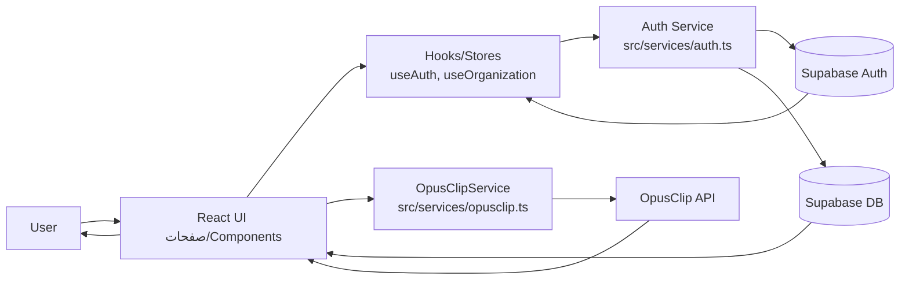

## Data Flow & Integrations

This repository implements a client-heavy web application (React) where most “business” data operations are executed from the frontend against **Supabase** (authentication + database) and a small set of **external APIs** (notably OpusClip). There is no separate server-side “backend-for-frontend” layer visible in the codebase; instead, the service layer in `src/services/` encapsulates access to external systems and is consumed by pages/components/hooks.

At a high level, data enters the system through:

- **User input** in UI forms and interactions (login/signup, organization selection, content creation actions).
- **Authentication events** from Supabase (session changes, token refresh), listened to at app bootstrap.
- **Remote reads/writes** to Supabase tables (typed by `src/types/database.types.ts`).
- **External media processing** requests to OpusClip via `OpusClipService`.

Data moves through the system as:

1. **UI → Hooks/Stores**: Components capture user input and invoke hooks (e.g., `useAuth`, `useOrganization`) and/or service functions (`signIn`, `signUp`, etc.).
2. **Hooks/Services → External Systems**:
   - Auth-related calls go through `src/services/auth.ts` to Supabase Auth.
   - Organization/user context is derived from the authenticated user and related records (typed in `database.types.ts`).
   - Media processing goes through `src/services/opusclip.ts` to the OpusClip API.
3. **External Systems → Local State/UI**:
   - Supabase returns session/user, which updates app state and route access (e.g., ProtectedRoute behavior).
   - Supabase query results populate UI views and dashboards.
   - OpusClip responses (projects/clips) are used to update UI and/or persisted metadata (if stored in Supabase).

Data exits the system through:

- **Writes to Supabase** (e.g., user profile changes, last-login updates, content metadata).
- **Requests to external APIs** (OpusClip project creation, clip retrieval).
- **User-visible output** (rendered pages/components, notifications via toast/sonner hooks).

> Cross-reference: this document describes runtime flow; structural layering and module boundaries are covered in [architecture.md](./architecture.md).

---

## Module Dependencies

Key cross-module dependencies as they appear in the codebase:

- **`src/pages/**`** → `src/components/**`, `src/components/layout/**`, `src/hooks/**`, `src/services/**`, `src/utils/**`
- **`src/components/**`** → `src/components/ui/**`, `src/lib/**`, `src/hooks/**`, `src/services/**` (where components directly initiate actions)
- **`src/components/auth/**`** → `src/services/auth.ts`, `src/hooks/useAuth.ts`, `src/stores/authStore.ts` (auth state + route protection)
- **`src/components/layout/**`** → `src/hooks/**`, `src/components/ui/**`
- **`src/hooks/**`** → `src/services/**`, `src/stores/**`, `src/types/**`
  - `src/hooks/useAuth.ts` → `src/services/auth.ts`, auth store
  - `src/hooks/useOrganization.ts` → organization/user data (typed via `src/types/database.types.ts`)
- **`src/services/**`** → external clients/config (`Supabase` client, `fetch`/HTTP), `src/types/**`
  - `src/services/auth.ts` → Supabase Auth + database updates
  - `src/services/opusclip.ts` → OpusClip HTTP API + request/response types
- **`src/stores/**`** → `src/types/**` (state typing), consumed by hooks/components
- **`src/utils/**`** → shared formatting/helpers, used across components/pages
- **`src/lib/**`** → UI utility helpers (e.g., `cn`), used broadly in UI components
- **`src/types/**`** → generated/declared database and domain types, used across services/hooks/components

---

## Service Layer

Service entry points live in `src/services/`. These are the primary integration boundaries and should be treated as the “ports” of the application.

- **Authentication (Supabase)**
  - `signUp` / `signIn` / `signOut` / `getCurrentUser` / `updateLastLogin`  
    Implementation: [`src/services/auth.ts`](../src/services/auth.ts)

- **OpusClip integration**
  - `OpusClipService` (class) with request/response models:
    - `OpusClipProject`, `OpusClipClip`, `CreateProjectRequest`  
    Implementation: [`src/services/opusclip.ts`](../src/services/opusclip.ts)

> Related typed data models (Supabase tables and views) are defined in [`src/types/database.types.ts`](../src/types/database.types.ts) (e.g., `UsersRow`, `OrganizationsRow`, `VideosRow`, `PostsRow`, `ApiLogsRow`, `Database`).

---

## High-level Flow

The primary runtime pipeline is a **frontend-driven orchestration**:

1. **App bootstrap**
   - `src/main.tsx` wires the app and installs an auth listener (`SupabaseAuthListener`) to react to session changes.
2. **Authentication**
   - Auth forms call `signUp` / `signIn` in `src/services/auth.ts`.
   - On successful auth, session/user state is propagated through `useAuth` and store(s), enabling protected routes/components.
   - `updateLastLogin` persists last-login metadata back to Supabase.
3. **Context resolution (Organization/User)**
   - `useOrganization` resolves current organization context for the signed-in user (implementation-specific, but typically involves reading user/org relationships from Supabase tables typed in `database.types.ts`).
4. **Core domain workflows**
   - UI triggers reads/writes against Supabase tables (e.g., videos/posts).
   - Optional external processing: requests are sent to OpusClip via `OpusClipService`, then results are surfaced in UI and may be stored as records/logs.

### Mermaid: end-to-end request/response flow

---

## Internal Movement

### State propagation and access control

- **Auth state** is established by:
  - explicit calls (login/signup) and
  - **auth events** (session changes) via `SupabaseAuthListener` in `src/main.tsx`.
- **Protected navigation** is enforced in the component layer (see `src/components/auth/ProtectedRoute.tsx`), which depends on `useAuth` and underlying store state.
- **Organization scoping** is provided by `useOrganization`, which acts as a contextual selector so that pages/components can fetch and mutate data using the correct organization identifier(s).

### Data typing and boundaries

- Supabase data structures are strongly typed through `Database` and the `*Row` interfaces in `src/types/database.types.ts`. These types should be used:
  - in services when reading/writing table data,
  - in hooks when assembling view models,
  - in components when rendering lists/details.

### UI feedback loop

- User-triggered actions produce immediate UI state updates and notifications using the toast system (`src/hooks/use-toast.ts` + `src/components/ui/sonner.tsx`), which is typically used to surface:
  - auth failures,
  - network errors,
  - successful completion messages.

---

## External Integrations

### Supabase (Auth + Database)

- **Purpose**
  - Identity management (sign-up/sign-in/sign-out, session handling)
  - Persistent storage for domain entities (organizations, users, videos, posts, API logs)
- **Primary entry points**
  - Auth: [`src/services/auth.ts`](../src/services/auth.ts)
  - Types: [`src/types/database.types.ts`](../src/types/database.types.ts)
- **Authentication**
  - Supabase session/JWT managed by Supabase client; app reacts to session changes via listener.
- **Payload shapes**
  - Auth calls are standard credential payloads (email/password).
  - Database rows are typed:
    - `OrganizationsRow`, `UsersRow`, `VideosRow`, `PostsRow`, `ApiLogsRow`
- **Retry strategy**
  - Not explicitly implemented at the service layer in this repo; relies on:
    - user-initiated retries in UI,
    - upstream client/network behavior.
  - For architected resiliency, consider adding:
    - idempotent writes where possible,
    - exponential backoff for transient failures,
    - centralized error normalization in `src/services/*`.

### OpusClip API

- **Purpose**
  - Create and manage clip-generation projects and retrieve generated clips.
- **Primary entry point**
  - [`src/services/opusclip.ts`](../src/services/opusclip.ts) (`OpusClipService`)
- **Authentication**
  - Typically API-key/Bearer based (implementation details are in the service; ensure secrets are not shipped to the browser if the API key is privileged).
- **Payload shapes (typed)**
  - Request: `CreateProjectRequest`
  - Response models: `OpusClipProject`, `OpusClipClip`
- **Retry strategy**
  - Not explicitly visible as a generalized policy. Given media processing is often async/long-running:
    - implement polling with bounded retries for clip readiness,
    - add backoff on `429`/`5xx`,
    - record attempts/outcomes (potentially into `ApiLogsRow` if used for integration logging).

---

## Observability & Failure Modes

### What to observe

- **Auth lifecycle**
  - Session changes (login/logout/refresh) via `SupabaseAuthListener`
  - Failed auth attempts surfaced to UI (toast) and optionally persisted
- **Integration calls**
  - OpusClip request latency, error rates, and success completion rate
  - Supabase query/mutation latency and error rates
- **User journey health**
  - Route protection failures (unexpected unauthenticated state)
  - Organization context resolution failures (missing memberships, null org)

### Common failure modes and recommended handling

- **Expired/invalid session**
  - Symptom: protected routes redirect unexpectedly; Supabase calls fail with auth errors.
  - Handling: centralize a “session invalidated” path in `useAuth` and force re-authentication; clear cached organization state.

- **Partial writes / inconsistent state**
  - Symptom: user action triggers an external request (OpusClip) but DB write/log fails (or vice versa).
  - Handling: implement compensating actions:
    - store a “pending” record before calling OpusClip,
    - update to “complete/failed” after response,
    - allow replay from UI for “pending/failed” states.

- **Rate limiting / transient network errors**
  - Symptom: `429`, intermittent `5xx`, fetch timeouts.
  - Handling: adopt exponential backoff + jitter in `OpusClipService` (and optionally DB reads that are safe to retry); provide deterministic user messaging and a manual retry control.

- **Silent client-side failures**
  - Symptom: errors only visible in console; no audit trail.
  - Handling: write integration errors to an API log table (typed as `ApiLogsRow`), and/or integrate with a client error tracking tool; ensure correlation IDs per workflow execution.

---

## Related Resources

- [architecture.md](./architecture.md)
