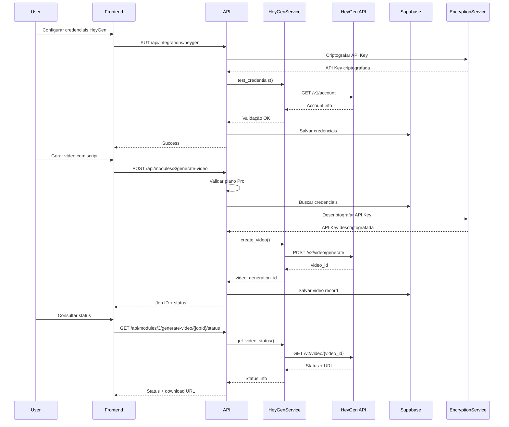

# Design Document - AvatarAI Module

## Overview

O módulo AvatarAI implementa integração self-service com a API REST do HeyGen para geração de vídeos com avatares digitais. Cada organização gerencia suas próprias credenciais (API Key, Avatar ID, Voice ID) e créditos HeyGen, proporcionando autonomia completa.

A arquitetura segue o padrão estabelecido nos módulos anteriores:
- **HeyGenService**: Integração REST com HeyGen API usando httpx
- **Endpoints REST**: Rotas FastAPI para configuração e geração
- **Segurança**: Criptografia de API Keys via EncryptionService existente
- **Validação**: Plano Pro obrigatório para acesso ao módulo
- **Logs**: Registro completo em api_logs para auditoria

## Architecture

### High-Level Flow



### Component Architecture

```
backend/
├── app/
│   ├── services/
│   │   └── heygen.py              # NEW: HeyGen API integration
│   ├── api/
│   │   └── routes/
│   │       ├── integrations.py    # NEW: Credentials management
│   │       └── module3.py         # NEW: Video generation endpoints
│   ├── core/
│   │   └── security.py            # EXISTING: Auth + encryption
│   └── models/
│       └── heygen.py              # NEW: Pydantic models
```

## Components and Interfaces

### 1. HeyGenService (app/services/heygen.py)

Serviço responsável por todas interações com a API REST do HeyGen.

**Dependencies:**
- httpx: Cliente HTTP assíncrono
- EncryptionService: Descriptografia de API Keys
- Logger: Registro de operações

**Methods:**

```python
class HeyGenService:
    BASE_URL = "https://api.heygen.com"
    
    async def test_credentials(self, api_key: str) -> Dict[str, Any]:
        """
        Valida API Key fazendo chamada de teste
        
        Endpoint: GET /v1/account
        Headers: X-Api-Key: {api_key}
        
        Returns:
            {
                "valid": bool,
                "account_name": str,
                "credits_remaining": float
            }
        
        Raises:
            Exception: Se API Key inválida ou erro de rede
        """
    
    async def get_avatars(self, api_key: str) -> List[Dict[str, Any]]:
        """
        Lista avatares disponíveis na conta
        
        Endpoint: GET /v2/avatars
        Headers: X-Api-Key: {api_key}
        
        Returns:
            [
                {
                    "avatar_id": str,
                    "avatar_name": str,
                    "preview_image_url": str,
                    "gender": str
                }
            ]
        """
    
    async def get_voices(
        self, 
        api_key: str, 
        language: Optional[str] = None
    ) -> List[Dict[str, Any]]:
        """
        Lista vozes disponíveis
        
        Endpoint: GET /v2/voices
        Headers: X-Api-Key: {api_key}
        Query: language (opcional)
        
        Returns:
            [
                {
                    "voice_id": str,
                    "voice_name": str,
                    "language": str,
                    "gender": str,
                    "preview_audio_url": str
                }
            ]
        """
    
    async def get_credits(self, api_key: str) -> Dict[str, Any]:
        """
        Consulta créditos disponíveis
        
        Endpoint: GET /v1/user/remaining_quota
        Headers: X-Api-Key: {api_key}
        
        Returns:
            {
                "remaining_credits": float,
                "total_credits": float,
                "credits_used": float
            }
        """
    
    async def create_video(
        self,
        api_key: str,
        script: str,
        avatar_id: str,
        voice_id: str,
        title: Optional[str] = None,
        **kwargs
    ) -> Dict[str, Any]:
        """
        Cria job de geração de vídeo
        
        Endpoint: POST /v2/video/generate
        Headers: X-Api-Key: {api_key}
        Body:
            {
                "video_inputs": [
                    {
                        "character": {
                            "type": "avatar",
                            "avatar_id": str
                        },
                        "voice": {
                            "type": "text",
                            "voice_id": str,
                            "input_text": str
                        }
                    }
                ],
                "dimension": {
                    "width": 1920,
                    "height": 1080
                },
                "title": str (opcional)
            }
        
        Returns:
            {
                "video_id": str,
                "status": "processing"
            }
        
        Raises:
            Exception: Se créditos insuficientes ou erro na API
        """
    
    async def get_video_status(
        self, 
        api_key: str, 
        video_id: str
    ) -> Dict[str, Any]:
        """
        Consulta status de geração
        
        Endpoint: GET /v2/video/{video_id}
        Headers: X-Api-Key: {api_key}
        
        Returns:
            {
                "video_id": str,
                "status": "processing" | "completed" | "failed",
                "video_url": str (se completed),
                "error": str (se failed),
                "duration": float (se completed),
                "thumbnail_url": str (se completed)
            }
        """
    
    async def download_video(
        self, 
        api_key: str, 
        video_id: str
    ) -> bytes:
        """
        Baixa vídeo gerado
        
        Primeiro obtém URL via get_video_status, depois faz download
        
        Returns:
            bytes: Conteúdo do arquivo de vídeo
        
        Raises:
            Exception: Se vídeo não estiver pronto ou erro no download
        """
```

**Error Handling:**

```python
# Mapeamento de erros HTTP para mensagens user-friendly
ERROR_MESSAGES = {
    401: "Credenciais HeyGen inválidas. Verifique sua API Key em Configurações",
    402: "Créditos HeyGen insuficientes. Recarregue sua conta em heygen.com",
    404: "Recurso não encontrado. Verifique o ID informado",
    429: "Limite de requisições atingido. Aguarde alguns minutos e tente novamente",
    500: "Serviço HeyGen temporariamente indisponível. Tente novamente em alguns minutos"
}
```

### 2. Integration Endpoints (app/api/routes/integrations.py)

Endpoints para gerenciamento de credenciais HeyGen.

**PUT /api/integrations/heygen**

Salva ou atualiza credenciais HeyGen da organização.

Request:
```json
{
    "api_key": "heygen_api_key_xxx",
    "avatar_id": "avatar_123",
    "voice_id": "voice_456"
}
```

Response (200):
```json
{
    "success": true,
    "message": "Credenciais HeyGen configuradas com sucesso",
    "credits_remaining": 150.5
}
```

Response (400 - Validação falhou):
```json
{
    "success": false,
    "error": "Credenciais HeyGen inválidas. Verifique sua API Key em Configurações"
}
```

**POST /api/integrations/heygen/test**

Testa conexão com HeyGen usando credenciais salvas.

Response (200):
```json
{
    "success": true,
    "message": "Conexão com HeyGen estabelecida",
    "account_name": "Minha Empresa",
    "credits_remaining": 150.5
}
```

**GET /api/integrations/heygen/credits**

Consulta créditos HeyGen disponíveis.

Response (200):
```json
{
    "remaining_credits": 150.5,
    "total_credits": 200.0,
    "credits_used": 49.5,
    "low_credits_warning": false
}
```

**GET /api/integrations/heygen/avatars**

Lista avatares disponíveis na conta HeyGen.

Response (200):
```json
{
    "avatars": [
        {
            "avatar_id": "avatar_123",
            "avatar_name": "John Professional",
            "preview_image_url": "https://...",
            "gender": "male"
        }
    ]
}
```

**GET /api/integrations/heygen/voices**

Lista vozes disponíveis.

Query params:
- `language` (opcional): Filtrar por idioma (pt, en, es, etc.)

Response (200):
```json
{
    "voices": [
        {
            "voice_id": "voice_456",
            "voice_name": "Maria Brazilian",
            "language": "pt",
            "gender": "female",
            "preview_audio_url": "https://..."
        }
    ]
}
```

### 3. Module 3 Endpoints (app/api/routes/module3.py)

Endpoints para geração de vídeos com avatares.

**POST /api/modules/3/generate-video**

Inicia geração de vídeo com avatar.

Request:
```json
{
    "script": "Olá! Bem-vindo ao nosso canal...",
    "title": "Vídeo de Boas-Vindas",
    "avatar_id": "avatar_123",  // opcional, usa padrão da org
    "voice_id": "voice_456",    // opcional, usa padrão da org
    "dimension": {              // opcional
        "width": 1920,
        "height": 1080
    }
}
```

Response (202 - Accepted):
```json
{
    "success": true,
    "job_id": "uuid-video-job",
    "video_id": "heygen_video_123",
    "status": "processing",
    "message": "Vídeo em processamento. Consulte o status em alguns minutos"
}
```

Response (400 - Script inválido):
```json
{
    "success": false,
    "error": "Script muito longo. Máximo: 5000 caracteres"
}
```

Response (400 - Credenciais não configuradas):
```json
{
    "success": false,
    "error": "Configure suas credenciais HeyGen em Configurações > Integrações"
}
```

Response (402 - Créditos insuficientes):
```json
{
    "success": false,
    "error": "Créditos HeyGen insuficientes. Recarregue sua conta em heygen.com"
}
```

Response (403 - Plano insuficiente):
```json
{
    "success": false,
    "error": "Módulo AvatarAI disponível apenas no plano Pro"
}
```

**GET /api/modules/3/generate-video/{jobId}/status**

Consulta status de geração de vídeo.

Response (200 - Processing):
```json
{
    "job_id": "uuid-video-job",
    "video_id": "heygen_video_123",
    "status": "processing",
    "progress": 45,
    "estimated_time_remaining": 120
}
```

Response (200 - Completed):
```json
{
    "job_id": "uuid-video-job",
    "video_id": "heygen_video_123",
    "status": "completed",
    "video_url": "https://supabase.../video.mp4",
    "duration": 45.5,
    "thumbnail_url": "https://...",
    "created_at": "2024-01-15T10:30:00Z"
}
```

Response (200 - Failed):
```json
{
    "job_id": "uuid-video-job",
    "video_id": "heygen_video_123",
    "status": "failed",
    "error": "Falha na geração do vídeo. Tente novamente"
}
```

**POST /api/modules/3/send-to-postrapido**

Envia vídeo gerado para o módulo PostRápido.

Request:
```json
{
    "video_id": "uuid-video-job"
}
```

Response (200):
```json
{
    "success": true,
    "message": "Vídeo enviado para PostRápido",
    "redirect_url": "/modules/2?video_id=uuid-video-job"
}
```

Response (400 - Vídeo não pronto):
```json
{
    "success": false,
    "error": "Aguarde a conclusão da geração do vídeo"
}
```

## Data Models

### Database Schema Updates

Verificar campos existentes via Supabase MCP antes de criar migration.

**organizations table** (campos esperados):
```sql
-- Campos HeyGen (verificar se existem)
heygen_api_key TEXT,              -- API Key criptografada
heygen_avatar_id TEXT,            -- Avatar ID padrão
heygen_voice_id TEXT,             -- Voice ID padrão
heygen_credits_used DECIMAL,      -- Créditos consumidos
heygen_credits_total DECIMAL      -- Total de créditos
```

**videos table** (campos esperados):
```sql
-- Campo recording_source já existe (verificar valores permitidos)
recording_source TEXT CHECK (recording_source IN ('upload', 'teleprompter', 'heygen')),

-- Novos campos para HeyGen
heygen_video_id TEXT,             -- ID do vídeo no HeyGen
heygen_job_status TEXT,           -- processing, completed, failed
heygen_error_message TEXT         -- Mensagem de erro se falhar
```

**Migration necessária** (apenas se campos não existirem):
```sql
-- 003_add_heygen_fields.sql

-- Add HeyGen fields to organizations if not exist
ALTER TABLE organizations 
ADD COLUMN IF NOT EXISTS heygen_api_key TEXT,
ADD COLUMN IF NOT EXISTS heygen_avatar_id TEXT,
ADD COLUMN IF NOT EXISTS heygen_voice_id TEXT,
ADD COLUMN IF NOT EXISTS heygen_credits_used DECIMAL DEFAULT 0,
ADD COLUMN IF NOT EXISTS heygen_credits_total DECIMAL DEFAULT 0;

-- Add HeyGen fields to videos if not exist
ALTER TABLE videos
ADD COLUMN IF NOT EXISTS heygen_video_id TEXT,
ADD COLUMN IF NOT EXISTS heygen_job_status TEXT,
ADD COLUMN IF NOT EXISTS heygen_error_message TEXT;

-- Create index for faster queries
CREATE INDEX IF NOT EXISTS idx_videos_heygen_video_id ON videos(heygen_video_id);
CREATE INDEX IF NOT EXISTS idx_videos_heygen_status ON videos(heygen_job_status);
```

### Pydantic Models (app/models/heygen.py)

```python
from pydantic import BaseModel, Field, validator
from typing import Optional, Dict, Any
from datetime import datetime

class HeyGenCredentials(BaseModel):
    """Credenciais HeyGen fornecidas pelo usuário"""
    api_key: str = Field(..., min_length=10)
    avatar_id: str = Field(..., min_length=1)
    voice_id: str = Field(..., min_length=1)

class HeyGenAvatar(BaseModel):
    """Avatar disponível no HeyGen"""
    avatar_id: str
    avatar_name: str
    preview_image_url: str
    gender: str

class HeyGenVoice(BaseModel):
    """Voz disponível no HeyGen"""
    voice_id: str
    voice_name: str
    language: str
    gender: str
    preview_audio_url: Optional[str] = None

class VideoGenerationRequest(BaseModel):
    """Request para geração de vídeo"""
    script: str = Field(..., min_length=1, max_length=5000)
    title: Optional[str] = Field(None, max_length=200)
    avatar_id: Optional[str] = None
    voice_id: Optional[str] = None
    dimension: Optional[Dict[str, int]] = Field(
        default={"width": 1920, "height": 1080}
    )
    
    @validator('script')
    def script_not_empty(cls, v):
        if not v.strip():
            raise ValueError('Script não pode estar vazio')
        return v.strip()

class VideoGenerationResponse(BaseModel):
    """Response de geração de vídeo"""
    success: bool
    job_id: str
    video_id: str
    status: str
    message: str

class VideoStatusResponse(BaseModel):
    """Response de status de vídeo"""
    job_id: str
    video_id: str
    status: str  # processing, completed, failed
    progress: Optional[int] = None
    estimated_time_remaining: Optional[int] = None
    video_url: Optional[str] = None
    duration: Optional[float] = None
    thumbnail_url: Optional[str] = None
    error: Optional[str] = None
    created_at: Optional[datetime] = None
```

## Correctness Properties

*A property is a characteristic or behavior that should hold true across all valid executions of a system—essentially, a formal statement about what the system should do. Properties serve as the bridge between human-readable specifications and machine-verifiable correctness guarantees.*


### Property 1: API Key Encryption on Storage

*For any* valid HeyGen API Key submitted by a user, when stored in the database, the stored value should be encrypted and not equal to the original plaintext value.

**Validates: Requirements 1.3, 1.4**

### Property 2: Credentials Validation Before Storage

*For any* HeyGen credentials submission, the system should validate the API Key by making a test call to HeyGen API before storing the credentials in the database.

**Validates: Requirements 1.2**

### Property 3: API Key Decryption for Requests

*For any* request to HeyGen API, if the organization has stored encrypted credentials, the system should decrypt the API Key before including it in the request headers.

**Validates: Requirements 2.1**

### Property 4: Avatar List Completeness

*For any* avatar list response from HeyGen API, all returned avatars should contain avatar_id, avatar_name, and preview_image_url fields.

**Validates: Requirements 2.2**

### Property 5: Voice List Completeness

*For any* voice list response from HeyGen API, all returned voices should contain voice_id, voice_name, language, and gender fields.

**Validates: Requirements 2.4**

### Property 6: Language Filter Propagation

*For any* voice list request with a language filter specified, the request to HeyGen API should include that language as a query parameter.

**Validates: Requirements 2.3**

### Property 7: Credits Synchronization

*For any* successful credits query to HeyGen API, the system should update both heygen_credits_total and heygen_credits_used fields in the organizations table with the returned values.

**Validates: Requirements 3.2, 3.3**

### Property 8: Script Validation

*For any* video generation request, the system should reject scripts that are empty or exceed 5000 characters before making any API calls.

**Validates: Requirements 4.1**

### Property 9: Credentials Check Before Generation

*For any* valid script submission, the system should verify that HeyGen credentials are configured for the organization before attempting to create a video.

**Validates: Requirements 4.2**

### Property 10: Complete Video Generation Request

*For any* video generation request to HeyGen API, the request body should include script, avatar_id, and voice_id fields.

**Validates: Requirements 4.3**

### Property 11: Video Record Creation

*For any* successful video generation request, the system should create a database record with recording_source set to "heygen" and heygen_video_id set to the returned video ID.

**Validates: Requirements 4.4, 4.5**

### Property 12: Status Query Propagation

*For any* video status query, the system should use the correct heygen_video_id when making the request to HeyGen API.

**Validates: Requirements 5.1**

### Property 13: Processing Status Response

*For any* HeyGen API response with status "processing", the system response should include status "processing" and estimated_time_remaining.

**Validates: Requirements 5.2**

### Property 14: Completed Status Response

*For any* HeyGen API response with status "completed", the system response should include status "completed" and video_download_url.

**Validates: Requirements 5.3**

### Property 15: Database Update on Completion

*For any* video with status "completed" from HeyGen API, the system should update the videos table record with video_url and status "ready".

**Validates: Requirements 5.4**

### Property 16: Failed Status Response

*For any* HeyGen API response with status "failed", the system response should include status "failed" and a descriptive error_message.

**Validates: Requirements 5.5**

### Property 17: Video Download and Storage Pipeline

*For any* completed video, when download is requested, the system should: (1) fetch download URL from HeyGen, (2) download the video file, (3) upload to Supabase Storage, and (4) update the database with the storage URL.

**Validates: Requirements 6.1, 6.2, 6.3, 6.4**

### Property 18: PostRápido Transfer Validation

*For any* video sent to PostRápido, the system should first verify that the video has status "ready" before creating the PostRápido record.

**Validates: Requirements 7.1**

### Property 19: PostRápido Transfer Response

*For any* successful video transfer to PostRápido, the response should include success true and a redirect_url to the PostRápido page.

**Validates: Requirements 7.2, 7.3**

### Property 20: Pro Plan Enforcement

*For any* request to AvatarAI module endpoints, the system should verify that the organization has plan "pro" before processing the request.

**Validates: Requirements 8.1, 8.3**

### Property 21: Failed Plan Check Logging

*For any* failed plan verification, the system should create a log entry in api_logs recording the access attempt.

**Validates: Requirements 8.4**

### Property 22: Comprehensive API Logging

*For any* call to HeyGen API, the system should create a log entry in api_logs containing organization_id, module "3", endpoint, request_duration, status_code, and timestamp. If the call consumes credits, credits_consumed should be included. If the call fails, error_message should be included.

**Validates: Requirements 9.1, 9.2, 9.3, 9.4, 9.5**

### Property 23: Error Message Sanitization

*For any* error response returned to users, the response should not contain technical details from HeyGen API (such as internal error codes, stack traces, or API endpoint URLs).

**Validates: Requirements 10.6**

### Property 24: Default Avatar and Voice Handling

*For any* video generation request without explicit avatar_id or voice_id, the system should use heygen_avatar_id and heygen_voice_id from the organizations table. If explicit IDs are provided, those should be used instead of defaults.

**Validates: Requirements 11.1, 11.2, 11.4**


## Error Handling

### Error Response Strategy

Todas as mensagens de erro seguem o princípio de **user-friendly messaging**: nunca expor detalhes técnicos da API HeyGen, sempre orientar ação do usuário.

**HTTP Status Code Mapping:**

| HeyGen API Status | System Status | User Message |
|-------------------|---------------|--------------|
| 401 Unauthorized | 401 | "Credenciais HeyGen inválidas. Verifique sua API Key em Configurações" |
| 402 Payment Required | 402 | "Créditos HeyGen insuficientes. Recarregue sua conta em heygen.com" |
| 404 Not Found | 404 | "Recurso não encontrado. Verifique o ID informado" |
| 429 Rate Limit | 429 | "Limite de requisições atingido. Aguarde alguns minutos e tente novamente" |
| 500 Server Error | 500 | "Serviço HeyGen temporariamente indisponível. Tente novamente em alguns minutos" |
| Timeout | 504 | "Tempo de resposta excedido. Verifique sua conexão e tente novamente" |

**Validation Errors:**

| Validation | Status | Message |
|------------|--------|---------|
| Script vazio | 400 | "Script não pode estar vazio" |
| Script > 5000 chars | 400 | "Script muito longo. Máximo: 5000 caracteres" |
| Credenciais não configuradas | 400 | "Configure suas credenciais HeyGen em Configurações > Integrações" |
| Avatar/Voice padrão ausente | 400 | "Configure avatar e voz padrão em Configurações > Integrações" |
| Vídeo não pronto | 425 | "Vídeo ainda está sendo processado. Aguarde alguns minutos" |
| Plano insuficiente | 403 | "Módulo AvatarAI disponível apenas no plano Pro" |

**Error Logging:**

Todos os erros devem ser registrados em `api_logs` com:
- `organization_id`: ID da organização
- `module`: "3"
- `endpoint`: Endpoint chamado
- `status_code`: Código HTTP
- `error_message`: Mensagem de erro técnica (para debug interno)
- `timestamp`: Data/hora do erro

**Exception Handling Pattern:**

```python
try:
    # HeyGen API call
    response = await heygen_service.create_video(...)
except httpx.HTTPStatusError as e:
    # Map HTTP status to user message
    user_message = ERROR_MESSAGES.get(e.response.status_code, "Erro ao processar requisição")
    
    # Log technical details
    logger.error(f"HeyGen API error: {e.response.status_code} - {e.response.text}")
    await log_api_call(
        organization_id=org_id,
        module="3",
        endpoint="create_video",
        status_code=e.response.status_code,
        error_message=e.response.text
    )
    
    # Return user-friendly error
    raise HTTPException(status_code=e.response.status_code, detail=user_message)
except httpx.TimeoutException:
    logger.error("HeyGen API timeout")
    raise HTTPException(status_code=504, detail="Tempo de resposta excedido. Verifique sua conexão e tente novamente")
except Exception as e:
    logger.error(f"Unexpected error: {e}", exc_info=True)
    raise HTTPException(status_code=500, detail="Erro interno do servidor. Tente novamente")
```

## Testing Strategy

### Dual Testing Approach

O módulo AvatarAI requer tanto **unit tests** quanto **property-based tests** para cobertura completa:

**Unit Tests** focam em:
- Casos específicos de erro (401, 402, 429, 500)
- Validações de entrada (script vazio, > 5000 chars)
- Integração entre componentes (HeyGenService → Supabase)
- Edge cases (créditos zero, vídeo não encontrado)

**Property Tests** focam em:
- Propriedades universais (criptografia, round-trip JSON)
- Comportamento em múltiplos inputs (qualquer script válido, qualquer API key)
- Invariantes (logs sempre criados, timestamps sempre presentes)

### Property-Based Testing Configuration

**Framework:** `hypothesis` (Python)

**Configuração mínima:** 100 iterações por teste

**Tag format:** Cada teste deve referenciar a propriedade do design:
```python
# Feature: avatarAI, Property 1: API Key Encryption on Storage
@given(api_key=st.text(min_size=10, max_size=100))
async def test_api_key_encryption(api_key):
    # Test implementation
    pass
```

### Test Coverage Requirements

**HeyGenService:**
- ✅ Unit: Testar cada método com mock da API HeyGen
- ✅ Property: Testar que todas chamadas incluem headers corretos
- ✅ Property: Testar round-trip de serialização JSON

**Integration Endpoints:**
- ✅ Unit: Testar fluxo completo de configuração de credenciais
- ✅ Unit: Testar cada tipo de erro (401, 402, etc.)
- ✅ Property: Testar que API Key sempre é criptografada antes de salvar

**Module 3 Endpoints:**
- ✅ Unit: Testar geração de vídeo com script válido
- ✅ Unit: Testar validações (script vazio, muito longo)
- ✅ Property: Testar que defaults são usados quando IDs não especificados
- ✅ Property: Testar que logs são sempre criados

**Error Handling:**
- ✅ Unit: Testar cada mapeamento de erro HTTP
- ✅ Property: Testar que mensagens nunca contêm detalhes técnicos

### Mock Strategy

Para testes, usar mocks da API HeyGen:

```python
@pytest.fixture
def mock_heygen_api(httpx_mock):
    """Mock HeyGen API responses"""
    httpx_mock.add_response(
        url="https://api.heygen.com/v1/account",
        json={"account_name": "Test Account", "credits": 100}
    )
    httpx_mock.add_response(
        url="https://api.heygen.com/v2/video/generate",
        json={"video_id": "test_video_123", "status": "processing"}
    )
    return httpx_mock
```

### Integration Testing

Testes de integração devem validar:
1. Fluxo completo: Configurar credenciais → Gerar vídeo → Consultar status → Download
2. Integração com Supabase: Salvar/buscar credenciais, criar registros de vídeo
3. Integração com EncryptionService: Criptografar/descriptografar API Keys
4. Integração com PostRápido: Transferir vídeo pronto

### Test Data Generators

Para property tests, usar geradores Hypothesis:

```python
from hypothesis import strategies as st

# Script válido (1-5000 chars)
valid_script = st.text(min_size=1, max_size=5000)

# API Key (formato realista)
api_key = st.text(min_size=20, max_size=100, alphabet=st.characters(whitelist_categories=('Lu', 'Ll', 'Nd')))

# Avatar/Voice IDs
resource_id = st.text(min_size=5, max_size=50, alphabet=st.characters(whitelist_categories=('Lu', 'Ll', 'Nd', 'P')))

# Video status
video_status = st.sampled_from(['processing', 'completed', 'failed'])
```

## Implementation Notes

### Security Considerations

1. **API Key Storage**: SEMPRE usar EncryptionService antes de salvar no banco
2. **API Key em Logs**: NUNCA logar API Keys em plaintext
3. **Error Messages**: NUNCA expor detalhes técnicos da API HeyGen ao usuário
4. **RLS Policies**: Garantir que usuários só acessem credenciais da própria organização

### Performance Considerations

1. **Async Operations**: Todas chamadas HTTP devem ser assíncronas (httpx.AsyncClient)
2. **Timeouts**: Configurar timeouts apropriados (30s para queries, 60s para geração)
3. **Retry Logic**: Implementar retry com backoff exponencial para erros 429 e 500
4. **Caching**: Considerar cache de lista de avatares/vozes (mudam raramente)

### HeyGen API Rate Limits

Segundo documentação HeyGen:
- **Rate Limit**: 100 requests/minute por API Key
- **Video Generation**: Máximo 10 vídeos simultâneos em processamento
- **Polling**: Recomendado intervalo mínimo de 10 segundos entre status checks

**Implementação de Rate Limiting:**

```python
import asyncio
from datetime import datetime, timedelta

class RateLimiter:
    def __init__(self, max_requests=100, time_window=60):
        self.max_requests = max_requests
        self.time_window = time_window
        self.requests = []
    
    async def acquire(self):
        now = datetime.now()
        # Remove requests older than time window
        self.requests = [r for r in self.requests if now - r < timedelta(seconds=self.time_window)]
        
        if len(self.requests) >= self.max_requests:
            # Wait until oldest request expires
            wait_time = (self.requests[0] + timedelta(seconds=self.time_window) - now).total_seconds()
            await asyncio.sleep(wait_time)
        
        self.requests.append(now)
```

### Supabase Storage Integration

Vídeos gerados devem ser armazenados em `videos-raw` bucket (vídeos ainda não editados pelo PostRápido):

```python
async def upload_video_to_storage(
    video_bytes: bytes,
    organization_id: str,
    video_id: str
) -> str:
    """
    Upload video to Supabase Storage
    
    Returns:
        Public URL of uploaded video
    """
    file_path = f"{organization_id}/{video_id}.mp4"
    
    # Upload to Supabase Storage (videos-raw bucket for unedited videos)
    response = supabase.storage.from_("videos-raw").upload(
        file_path,
        video_bytes,
        file_options={"content-type": "video/mp4"}
    )
    
    # Get public URL
    public_url = supabase.storage.from_("videos-raw").get_public_url(file_path)
    
    return public_url
```

### Monitoring and Observability

Métricas importantes para monitorar:

1. **API Calls**: Total de chamadas à API HeyGen por organização
2. **Credits Consumed**: Créditos consumidos por organização
3. **Success Rate**: Taxa de sucesso de gerações de vídeo
4. **Average Duration**: Tempo médio de geração de vídeo
5. **Error Rate**: Taxa de erros por tipo (401, 402, 429, 500)

Implementar dashboard com queries:

```sql
-- Total de vídeos gerados por organização (últimos 30 dias)
SELECT 
    organization_id,
    COUNT(*) as total_videos,
    SUM(CASE WHEN heygen_job_status = 'completed' THEN 1 ELSE 0 END) as successful,
    SUM(CASE WHEN heygen_job_status = 'failed' THEN 1 ELSE 0 END) as failed
FROM videos
WHERE recording_source = 'heygen'
    AND created_at >= NOW() - INTERVAL '30 days'
GROUP BY organization_id;

-- Créditos consumidos por organização
SELECT 
    organization_id,
    heygen_credits_used,
    heygen_credits_total,
    (heygen_credits_total - heygen_credits_used) as remaining
FROM organizations
WHERE heygen_api_key IS NOT NULL
ORDER BY heygen_credits_used DESC;

-- Erros mais comuns
SELECT 
    status_code,
    COUNT(*) as occurrences,
    error_message
FROM api_logs
WHERE module = '3'
    AND status_code >= 400
    AND created_at >= NOW() - INTERVAL '7 days'
GROUP BY status_code, error_message
ORDER BY occurrences DESC;
```

## Deployment Checklist

Antes de fazer deploy do módulo AvatarAI:

- [ ] Verificar que EncryptionService está funcionando corretamente
- [ ] Executar migration de schema (se necessário)
- [ ] Configurar variáveis de ambiente (se houver)
- [ ] Testar integração com HeyGen API em staging
- [ ] Validar RLS policies no Supabase
- [ ] Configurar monitoring e alertas
- [ ] Documentar processo de configuração para usuários
- [ ] Criar tutorial em vídeo mostrando configuração
- [ ] Testar fluxo completo end-to-end
- [ ] Validar integração com PostRápido (Módulo 2)

## Future Enhancements

Possíveis melhorias futuras (fora do escopo atual):

1. **Batch Generation**: Gerar múltiplos vídeos de uma vez
2. **Template Library**: Biblioteca de templates de vídeo pré-configurados
3. **Custom Avatars**: Upload de avatares personalizados
4. **Voice Cloning**: Clonagem de voz do usuário
5. **Video Editing**: Edição básica de vídeos gerados (trim, merge)
6. **Analytics Dashboard**: Dashboard detalhado de uso e performance
7. **Webhook Integration**: Notificações quando vídeo estiver pronto
8. **Multi-language Scripts**: Suporte a scripts em múltiplos idiomas no mesmo vídeo
