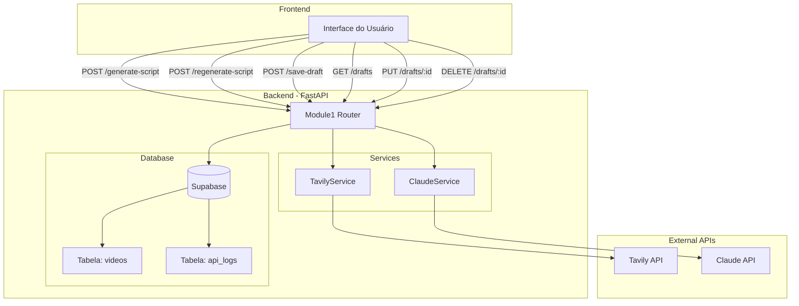
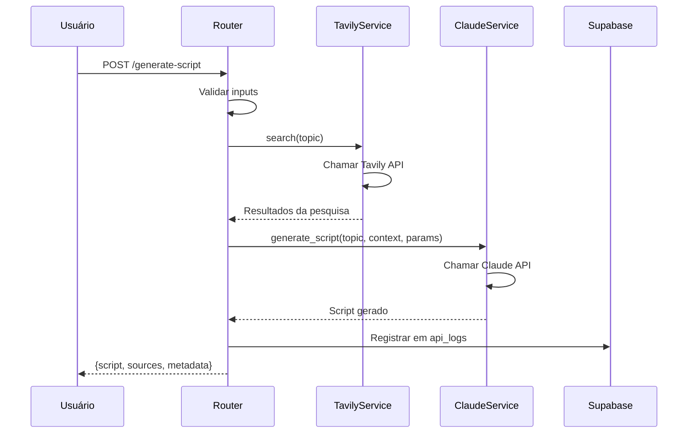
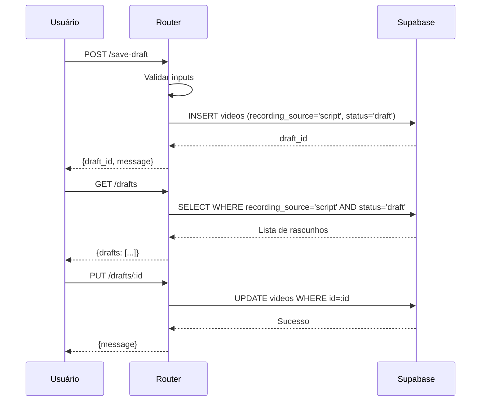

# Documento de Design - Módulo 1: ScriptAI

## Visão Geral

O Módulo 1 (ScriptAI) é um sistema de geração inteligente de scripts para vídeos de redes sociais que integra pesquisa web contextualizada (Tavily API) com geração de conteúdo via IA (Claude API). O sistema permite que usuários criem scripts otimizados baseados em temas específicos, gerenciem rascunhos e escolham entre três jornadas pós-aprovação: teleprompter, geração de vídeo com avatar AI, ou salvamento para uso posterior.

### Objetivos do Design

1. **Integração Robusta**: Criar serviços confiáveis para Tavily e Claude com tratamento de erros completo
2. **Experiência do Usuário**: Fluxo simples e intuitivo de geração → revisão → ação
3. **Flexibilidade**: Suportar múltiplas audiências, tons e durações
4. **Gestão de Conteúdo**: Sistema completo de CRUD para rascunhos
5. **Observabilidade**: Logging detalhado para monitoramento e debug
6. **Segurança**: Aplicação de RLS e validação de inputs em todos os endpoints

## Arquitetura

### Diagrama de Componentes



### Fluxo de Geração de Script



### Fluxo de Gestão de Rascunhos



## Componentes e Interfaces

### 1. TavilyService (`app/services/tavily.py`)

Serviço responsável pela integração com a API Tavily para pesquisa web.

```python
from app.config import settings


class TavilyService:
    """
    Serviço de integração com Tavily API para pesquisa web contextualizada.
    
    A API Key é configurada como credencial da organização RENUM, não do usuário.
    """
    
    BASE_URL = "https://api.tavily.com"
    API_KEY = settings.tavily_api_key
    TIMEOUT = 30.0  # segundos
    
    # Mapeamento de erros HTTP para mensagens user-friendly
    ERROR_MESSAGES = {
        401: "Credenciais Tavily inválidas. Contate o suporte.",
        429: "Limite de requisições excedido. Tente novamente em alguns minutos.",
        500: "Erro no servidor Tavily. Tente novamente mais tarde.",
        "timeout": "Tempo de conexão esgotado. Verifique sua conexão.",
        "connection": "Não foi possível conectar ao Tavily.",
        "default": "Erro ao realizar pesquisa. Tente novamente."
    }
    
    def __init__(self):
        """Inicializa o serviço Tavily."""
        self.client = httpx.AsyncClient(timeout=self.TIMEOUT)
    
    async def search(
        self,
        query: str,
        search_depth: str = "basic",
        max_results: int = 5,
        include_domains: Optional[List[str]] = None,
        exclude_domains: Optional[List[str]] = None
    ) -> Dict[str, Any]:
        """
        Realiza pesquisa web usando Tavily API.
        
        Args:
            query: Termo de pesquisa
            search_depth: Profundidade da pesquisa ("basic" ou "advanced")
            max_results: Número máximo de resultados (1-10)
            include_domains: Lista de domínios para incluir
            exclude_domains: Lista de domínios para excluir
        
        Returns:
            {
                "results": [
                    {
                        "title": str,
                        "url": str,
                        "content": str,
                        "score": float
                    }
                ],
                "query": str
            }
        
        Raises:
            Não lança exceções - retorna dict com "error" em caso de falha
        """
        pass
    
    async def extract(self, urls: List[str]) -> Dict[str, Any]:
        """
        Extrai conteúdo de URLs específicas (se disponível na API).
        
        Args:
            urls: Lista de URLs para extrair conteúdo
        
        Returns:
            {
                "extractions": [
                    {
                        "url": str,
                        "content": str,
                        "title": str
                    }
                ]
            }
        
        Raises:
            Não lança exceções - retorna dict com "error" em caso de falha
        """
        pass
    
    def _handle_error(self, error: Exception, endpoint: str = "") -> Dict[str, Any]:
        """
        Mapeia erros HTTP para mensagens user-friendly.
        
        Args:
            error: Exceção capturada
            endpoint: Endpoint que gerou o erro (para logging)
        
        Returns:
            Dict com "error" contendo mensagem user-friendly e código
        """
        pass
```

### 2. ClaudeService - Expansão (`app/services/claude.py`)

Expansão do serviço existente para adicionar geração de scripts.

```python
class ClaudeService:
    # ... métodos existentes ...
    
    async def generate_script_from_research(
        self,
        topic: str,
        research_context: str,
        audience: str,
        tone: str,
        duration_seconds: int,
        language: str,
        feedback: Optional[str] = None
    ) -> Dict[str, Any]:
        """
        Gera script para vídeo baseado em pesquisa contextualizada.
        
        Args:
            topic: Tema do script
            research_context: Contexto obtido da pesquisa Tavily
            audience: Audiência alvo ('mlm', 'politics', 'general')
            tone: Tom do script ('informal', 'professional', 'inspirational')
            duration_seconds: Duração alvo em segundos (30, 60, 90)
            language: Idioma do script ('pt-BR', 'en-US', 'es-ES')
            feedback: Feedback opcional para regeneração
        
        Returns:
            {
                "success": bool,
                "script": str,
                "word_count": int,
                "estimated_duration": int,
                "model": str
            }
        
        Raises:
            Exception se API Key não configurada ou erro na API
        """
        pass
```

### 3. Modelos Pydantic (`app/models/scriptai.py`)

Modelos para validação de requests e responses.

```python
from pydantic import BaseModel, Field, validator
from typing import Optional, List, Dict, Any
from datetime import datetime

class GenerateScriptRequest(BaseModel):
    """Request para geração de script."""
    topic: str = Field(..., min_length=3, max_length=500, description="Tema do script")
    audience: str = Field(..., description="Audiência alvo")
    tone: str = Field(..., description="Tom do script")
    duration: int = Field(..., description="Duração em segundos")
    language: str = Field(default="pt-BR", description="Idioma do script")
    
    @validator("audience")
    def validate_audience(cls, v):
        allowed = ["mlm", "politics", "general"]
        if v not in allowed:
            raise ValueError(f"audience deve ser um de: {', '.join(allowed)}")
        return v
    
    @validator("tone")
    def validate_tone(cls, v):
        allowed = ["informal", "professional", "inspirational"]
        if v not in allowed:
            raise ValueError(f"tone deve ser um de: {', '.join(allowed)}")
        return v
    
    @validator("duration")
    def validate_duration(cls, v):
        allowed = [30, 60, 90]
        if v not in allowed:
            raise ValueError(f"duration deve ser um de: {', '.join(map(str, allowed))}")
        return v

class RegenerateScriptRequest(GenerateScriptRequest):
    """Request para regeneração de script com feedback."""
    feedback: str = Field(..., min_length=10, max_length=500, description="Feedback para ajuste")

class ScriptResponse(BaseModel):
    """Response de geração de script."""
    script: str
    sources: List[Dict[str, str]]  # [{"title": str, "url": str}]
    metadata: Dict[str, Any]  # {topic, audience, tone, duration, language, word_count, etc}

class SaveDraftRequest(BaseModel):
    """Request para salvar rascunho."""
    title: str = Field(..., min_length=3, max_length=200)
    script: str = Field(..., min_length=10)
    metadata: Dict[str, Any]  # Parâmetros de geração + fontes

class UpdateDraftRequest(BaseModel):
    """Request para atualizar rascunho."""
    title: Optional[str] = Field(None, min_length=3, max_length=200)
    script: Optional[str] = Field(None, min_length=10)
    metadata: Optional[Dict[str, Any]] = None

class DraftResponse(BaseModel):
    """Response de rascunho."""
    id: str
    title: str
    script: str
    metadata: Dict[str, Any]
    created_at: datetime
    updated_at: datetime

class DraftListResponse(BaseModel):
    """Response de listagem de rascunhos."""
    drafts: List[DraftResponse]
    total: int
```

### 4. Router do Módulo 1 (`app/api/routes/module1.py`)

Endpoints do Módulo 1.

```python
from fastapi import APIRouter, Depends, HTTPException
from typing import List
from app.api.deps import get_current_organization
from app.services.tavily import TavilyService
from app.services.claude import ClaudeService
from app.models.scriptai import (
    GenerateScriptRequest, RegenerateScriptRequest, ScriptResponse,
    SaveDraftRequest, UpdateDraftRequest, DraftResponse, DraftListResponse
)
from app.database import supabase
from app.utils.logger import get_logger
from datetime import datetime
import asyncio
import uuid

router = APIRouter()
logger = get_logger("module1")

@router.post("/generate-script", response_model=ScriptResponse)
async def generate_script(
    request: GenerateScriptRequest,
    org_id: str = Depends(get_current_organization)
):
    """
    Gera script inteligente baseado em tema e parâmetros.
    
    Fluxo:
    1. Validar inputs
    2. Pesquisar contexto via Tavily
    3. Gerar script via Claude
    4. Retornar script + fontes + metadata
    5. Registrar em api_logs
    """
    pass

@router.post("/regenerate-script", response_model=ScriptResponse)
async def regenerate_script(
    request: RegenerateScriptRequest,
    org_id: str = Depends(get_current_organization)
):
    """
    Regenera script com feedback adicional do usuário.
    
    Fluxo idêntico ao generate_script, mas inclui feedback no prompt.
    """
    pass

@router.post("/scripts/save-draft", response_model=DraftResponse)
async def save_draft(
    request: SaveDraftRequest,
    org_id: str = Depends(get_current_organization)
):
    """
    Salva script como rascunho.
    
    Cria registro na tabela videos com:
    - recording_source='script'
    - status='draft'
    - script, metadata
    """
    pass

@router.get("/scripts/drafts", response_model=DraftListResponse)
async def list_drafts(
    org_id: str = Depends(get_current_organization)
):
    """
    Lista todos os rascunhos da organização.
    
    Filtra por recording_source='script' e status='draft'.
    Aplica RLS automaticamente.
    """
    pass

@router.get("/scripts/drafts/{draft_id}", response_model=DraftResponse)
async def get_draft(
    draft_id: str,
    org_id: str = Depends(get_current_organization)
):
    """
    Obtém detalhes de um rascunho específico.
    
    Valida que o rascunho pertence à organização do usuário.
    """
    pass

@router.put("/scripts/drafts/{draft_id}", response_model=DraftResponse)
async def update_draft(
    draft_id: str,
    request: UpdateDraftRequest,
    org_id: str = Depends(get_current_organization)
):
    """
    Atualiza um rascunho existente.
    
    Permite atualizar: title, script, metadata.
    Atualiza campo updated_at automaticamente.
    """
    pass

@router.delete("/scripts/drafts/{draft_id}")
async def delete_draft(
    draft_id: str,
    org_id: str = Depends(get_current_organization)
):
    """
    Deleta um rascunho.
    
    Remove registro da tabela videos.
    RLS garante que apenas rascunhos da organização podem ser deletados.
    """
    pass
```

## Modelos de Dados

### Tabela `videos` - Campos Relevantes

```sql
CREATE TABLE videos (
    id UUID PRIMARY KEY DEFAULT uuid_generate_v4(),
    organization_id UUID REFERENCES organizations(id) NOT NULL,
    user_id UUID REFERENCES users(id) NOT NULL,
    
    -- Conteúdo
    title TEXT NOT NULL,
    script TEXT,  -- Usado pelo Módulo 1
    
    -- URLs dos vídeos (não usado pelo Módulo 1 em drafts)
    video_raw_url TEXT,
    video_processed_url TEXT,
    thumbnail_url TEXT,
    
    -- Status
    status TEXT CHECK (status IN ('draft', 'processing', 'ready', 'posted', 'failed')) DEFAULT 'draft',
    
    -- NOVO: Origem do vídeo/script
    recording_source TEXT CHECK (recording_source IN ('upload', 'heygen', 'script')),
    
    -- Metadata (JSONB para flexibilidade)
    metadata JSONB,  -- Armazena parâmetros de geração + fontes
    
    -- Timestamps
    created_at TIMESTAMPTZ DEFAULT NOW(),
    updated_at TIMESTAMPTZ DEFAULT NOW()
);
```

### Estrutura do Campo `metadata` para Scripts

```json
{
  "generation_params": {
    "topic": "Estratégias de Marketing Digital",
    "audience": "mlm",
    "tone": "professional",
    "duration": 60,
    "language": "pt-BR"
  },
  "sources": [
    {
      "title": "10 Estratégias de Marketing Digital para 2024",
      "url": "https://example.com/article",
      "score": 0.95
    }
  ],
  "script_stats": {
    "word_count": 150,
    "estimated_duration": 58,
    "generated_at": "2024-01-15T10:30:00Z",
    "model": "claude-sonnet-4-20250514"
  },
  "feedback_history": [
    {
      "feedback": "Tornar mais inspiracional",
      "applied_at": "2024-01-15T10:35:00Z"
    }
  ]
}
```

### Tabela `api_logs` - Estrutura

A estrutura da tabela `api_logs` segue o padrão existente dos módulos 2 e 3 para manter consistência. O logging é simples e direto no banco de dados.

```sql
-- Estrutura existente (padrão dos módulos 2 e 3)
CREATE TABLE api_logs (
    id UUID PRIMARY KEY DEFAULT uuid_generate_v4(),
    organization_id UUID REFERENCES organizations(id),
    module TEXT NOT NULL,  -- '1' para Módulo 1
    endpoint TEXT NOT NULL,  -- '/generate-script', '/regenerate-script', etc
    status_code INTEGER NOT NULL,
    created_at TIMESTAMPTZ DEFAULT NOW()
);
```

**Nota:** O logging detalhado (request_body, response_body, duration_ms) fica a cargo do logger do Python (`logger.info/error`) para debug no servidor, não no banco de dados. Isso mantém consistência com os módulos 2 e 3.

## Propriedades de Corretude

*Uma propriedade é uma característica ou comportamento que deve ser verdadeiro em todas as execuções válidas de um sistema - essencialmente, uma declaração formal sobre o que o sistema deve fazer. Propriedades servem como a ponte entre especificações legíveis por humanos e garantias de corretude verificáveis por máquina.*


### Reflexão sobre Redundâncias

Após análise do prework, identifiquei as seguintes redundâncias que devem ser consolidadas:

**Grupo 1: Validação de Campos Enum**
- Propriedades 2.3, 2.4, 2.5 (validação de audience, tone, duration) podem ser consolidadas em uma única propriedade sobre validação de enums

**Grupo 2: Logging Universal**
- Propriedades 2.12, 3.7, 6.1 são essencialmente a mesma: todos os endpoints devem logar
- Propriedades 6.3, 6.4, 6.5 (service field) podem ser consolidadas em uma propriedade sobre mapeamento correto de service

**Grupo 3: Estrutura de Response**
- Propriedades 2.10 e 3.6 (estrutura de resposta) podem ser consolidadas: ambos endpoints retornam mesma estrutura

**Grupo 4: Tratamento de Erros**
- Propriedades 10.1 e 10.2 (mapeamento de erros de APIs externas) podem ser consolidadas
- Propriedades 10.4 e 10.8 (logging de erros) podem ser consolidadas

**Propriedades Finais Consolidadas:**
1. Validação de campos obrigatórios (2.2)
2. Validação de enums (2.3, 2.4, 2.5 consolidadas)
3. Estrutura de resposta de geração (2.10, 3.6 consolidadas)
4. Validação de inputs inválidos retorna 400 (2.11)
5. Logging universal de endpoints (2.12, 3.7, 6.1 consolidadas)
6. Validação de feedback obrigatório (3.2)
7. Salvamento de rascunho com campos corretos (4.2, 4.4 consolidadas)
8. Listagem filtra corretamente (4.6)
9. Atualização persiste mudanças (4.9)
10. Deleção remove registro (4.11)
11. RLS isola organizações (4.12)
12. Estrutura completa de logs (6.2)
13. Mapeamento correto de service em logs (6.3, 6.4, 6.5 consolidadas)
14. Logs de erro contêm detalhes (6.6)
15. Duration_ms é válido (6.7)
16. Acesso sem restrição de plano (7.1)
17. Mapeamento de erros de APIs externas (10.1, 10.2 consolidadas)
18. Erros de validação incluem detalhes (10.4)
19. Erros 500 não expõem detalhes técnicos (10.7)
20. Logs de erro são completos (10.8)
21. Resultados Tavily contêm campos obrigatórios (1.4)

### Propriedades de Corretude

#### Propriedade 1: Validação de Campos Obrigatórios
*Para qualquer* requisição ao endpoint `/generate-script` ou `/regenerate-script`, se algum campo obrigatório (topic, audience, tone, duration, language) estiver ausente, o sistema deve retornar erro 400 com mensagem descritiva.

**Valida: Requisitos 2.2**

#### Propriedade 2: Validação de Valores Enum
*Para qualquer* requisição com valores de `audience` fora de ['mlm', 'politics', 'general'], ou `tone` fora de ['informal', 'professional', 'inspirational'], ou `duration` fora de [30, 60, 90], o sistema deve rejeitar com erro 400.

**Valida: Requisitos 2.3, 2.4, 2.5**

#### Propriedade 3: Estrutura de Resposta de Geração
*Para qualquer* geração ou regeneração de script bem-sucedida, a resposta deve conter os campos obrigatórios: `script` (string), `sources` (array), `metadata` (object).

**Valida: Requisitos 2.10, 3.6**

#### Propriedade 4: Logging Universal de Endpoints
*Para qualquer* chamada a endpoints do Módulo 1 (`/generate-script`, `/regenerate-script`, `/save-draft`, `/drafts`, `/drafts/:id`), deve existir um registro correspondente na tabela `api_logs` após a execução.

**Valida: Requisitos 2.12, 3.7, 6.1**

#### Propriedade 5: Validação de Feedback Obrigatório
*Para qualquer* requisição ao endpoint `/regenerate-script`, se o campo `feedback` estiver ausente ou vazio, o sistema deve retornar erro 400.

**Valida: Requisitos 3.2**

#### Propriedade 6: Salvamento de Rascunho com Campos Corretos
*Para qualquer* rascunho salvo via `/save-draft`, o registro criado na tabela `videos` deve ter `recording_source='script'`, `status='draft'`, e conter os campos `title`, `script`, `metadata`.

**Valida: Requisitos 4.2, 4.4**

#### Propriedade 7: Listagem Filtra Corretamente
*Para qualquer* chamada ao endpoint `/drafts`, todos os itens retornados devem ter `recording_source='script'` e `status='draft'`, e pertencer à organização do usuário autenticado.

**Valida: Requisitos 4.6**

#### Propriedade 8: Atualização Persiste Mudanças
*Para qualquer* rascunho atualizado via `PUT /drafts/:id`, se um campo (`title`, `script`, ou `metadata`) for fornecido no request, o valor deve ser persistido no banco e refletido em consultas subsequentes.

**Valida: Requisitos 4.9**

#### Propriedade 9: Deleção Remove Registro
*Para qualquer* rascunho deletado via `DELETE /drafts/:id`, consultas subsequentes ao mesmo `draft_id` devem retornar erro 404.

**Valida: Requisitos 4.11**

#### Propriedade 10: RLS Isola Organizações
*Para qualquer* par de usuários de organizações diferentes, um usuário não deve conseguir acessar (listar, visualizar, atualizar ou deletar) rascunhos da organização do outro usuário.

**Valida: Requisitos 4.12**

#### Propriedade 11: Estrutura de Logs Consistente
*Para qualquer* registro em `api_logs` criado pelo Módulo 1, o registro deve conter os campos obrigatórios: `organization_id`, `module` (="1"), `endpoint`, `status_code`.

**Valida: Requisitos 6.2**

#### Propriedade 12: Logging de Erros no Servidor
*Para qualquer* erro (status >= 400), deve existir um log no servidor (via logger Python) contendo detalhes completos do erro, incluindo stack trace se aplicável.

**Valida: Requisitos 10.8**

#### Propriedade 15: Acesso Sem Restrição de Plano
*Para qualquer* usuário autenticado, independente do plano ('free', 'starter', 'pro'), o acesso aos endpoints do Módulo 1 deve ser permitido (não deve retornar erro 403 por restrição de plano).

**Valida: Requisitos 7.1**

#### Propriedade 16: Mapeamento de Erros de APIs Externas
*Para qualquer* erro retornado pelas APIs Tavily ou Claude, a mensagem de erro apresentada ao usuário deve estar em português brasileiro e não deve expor detalhes técnicos da API externa.

**Valida: Requisitos 10.1, 10.2**

#### Propriedade 17: Erros de Validação Incluem Detalhes
*Para qualquer* erro de validação (status 400), a resposta deve incluir uma lista ou descrição dos campos inválidos.

**Valida: Requisitos 10.4**

#### Propriedade 18: Erros 500 Não Expõem Detalhes Técnicos
*Para qualquer* erro interno (status 500), a resposta ao usuário não deve conter stack traces, nomes de variáveis internas, ou caminhos de arquivos do servidor.

**Valida: Requisitos 10.7**

#### Propriedade 19: Logs de Erro São Completos
*Para qualquer* erro (status >= 400), deve existir um log no servidor contendo detalhes completos do erro, incluindo stack trace se aplicável.

**Valida: Requisitos 10.8**

#### Propriedade 20: Resultados Tavily Contêm Campos Obrigatórios
*Para qualquer* pesquisa bem-sucedida via TavilyService, cada resultado retornado deve conter os campos: `title`, `url`, `content`, `score`.

**Valida: Requisitos 1.4**

## Tratamento de Erros

### Hierarquia de Erros

```python
# Códigos HTTP e suas aplicações no Módulo 1

400 Bad Request:
- Campos obrigatórios ausentes
- Valores de enum inválidos
- Formato de dados inválido
- Script muito longo (> 5000 caracteres)

401 Unauthorized:
- Token de autenticação ausente ou inválido
- Sessão expirada

403 Forbidden:
- Tentativa de acessar rascunho de outra organização (RLS)

404 Not Found:
- Rascunho não encontrado
- Endpoint não existe

429 Too Many Requests:
- Rate limit da API Tavily excedido

500 Internal Server Error:
- Erro não tratado no servidor
- Falha na comunicação com banco de dados

502 Bad Gateway:
- Erro na API Tavily
- Erro na API Claude

504 Gateway Timeout:
- Timeout na API Tavily
- Timeout na API Claude
```

### Mapeamento de Erros de APIs Externas

```python
# TavilyService
TAVILY_ERROR_MAP = {
    401: "Credenciais Tavily inválidas. Contate o suporte.",
    429: "Limite de requisições excedido. Tente novamente em alguns minutos.",
    500: "Erro no servidor Tavily. Tente novamente mais tarde.",
    "timeout": "Tempo de conexão esgotado. Verifique sua conexão.",
    "connection": "Não foi possível conectar ao Tavily.",
    "default": "Erro ao realizar pesquisa. Tente novamente."
}

# ClaudeService
CLAUDE_ERROR_MAP = {
    401: "Credenciais Claude inválidas. Contate o suporte.",
    429: "Limite de requisições Claude excedido. Tente novamente em alguns minutos.",
    500: "Erro no servidor Claude. Tente novamente mais tarde.",
    "timeout": "Tempo de geração excedido. Tente novamente.",
    "connection": "Não foi possível conectar ao Claude.",
    "default": "Erro ao gerar script. Tente novamente."
}
```

### Exemplo de Tratamento de Erro

```python
@router.post("/generate-script")
async def generate_script(request: GenerateScriptRequest, ...):
    start_time = datetime.utcnow()
    
    try:
        # Validação já feita pelo Pydantic
        
        # Pesquisa Tavily
        tavily_service = TavilyService()
        search_result = await tavily_service.search(request.topic)
        
        if "error" in search_result:
            # Logar erro detalhado
            logger.error(f"Tavily error: {search_result['error']}")
            
            # Retornar erro user-friendly
            raise HTTPException(
                status_code=502,
                detail=search_result["error"]["message"]
            )
        
        # Geração Claude
        claude_service = ClaudeService()
        script_result = await claude_service.generate_script_from_research(...)
        
        if not script_result.get("success"):
            logger.error(f"Claude error: {script_result}")
            raise HTTPException(
                status_code=502,
                detail="Erro ao gerar script. Tente novamente."
            )
        
        # Sucesso - registrar log
        duration_ms = int((datetime.utcnow() - start_time).total_seconds() * 1000)
        await supabase.table("api_logs").insert({
            "organization_id": org_id,
            "module": "1",
            "endpoint": "/generate-script",
            "status_code": 200
        }).execute()
        
        return ScriptResponse(...)
        
    except HTTPException:
        raise
    except Exception as e:
        # Erro não tratado - logar detalhes completos
        logger.error(f"Unexpected error in generate_script: {e}", exc_info=True)
        
        # Retornar erro genérico ao usuário
        raise HTTPException(
            status_code=500,
            detail="Erro interno. Tente novamente."
        )
```

## Estratégia de Testes

### Abordagem Dual: Testes Unitários + Testes Baseados em Propriedades

O Módulo 1 será testado usando duas abordagens complementares:

1. **Testes Unitários**: Para casos específicos, exemplos e edge cases
2. **Testes Baseados em Propriedades (PBT)**: Para validar propriedades universais

### Configuração de Testes Baseados em Propriedades

**Biblioteca**: `hypothesis` (Python)

**Configuração Mínima**:
- 100 iterações por teste de propriedade
- Cada teste deve referenciar a propriedade do design
- Tag format: `# Feature: scriptai-module, Property N: [descrição]`

### Exemplos de Testes

#### Teste Unitário - Exemplo Específico

```python
import pytest
from app.api.routes.module1 import router
from fastapi.testclient import TestClient

def test_generate_script_with_valid_inputs():
    """
    Testa geração de script com inputs válidos.
    Exemplo específico de caso de sucesso.
    """
    client = TestClient(router)
    
    response = client.post("/generate-script", json={
        "topic": "Marketing Digital para MLM",
        "audience": "mlm",
        "tone": "professional",
        "duration": 60,
        "language": "pt-BR"
    })
    
    assert response.status_code == 200
    data = response.json()
    assert "script" in data
    assert "sources" in data
    assert "metadata" in data
```

#### Teste Baseado em Propriedade

```python
from hypothesis import given, strategies as st
import pytest

# Feature: scriptai-module, Property 2: Validação de Valores Enum
@given(
    audience=st.text().filter(lambda x: x not in ["mlm", "politics", "general"]),
    tone=st.sampled_from(["informal", "professional", "inspirational"]),
    duration=st.sampled_from([30, 60, 90])
)
def test_property_invalid_audience_rejected(audience, tone, duration):
    """
    Propriedade: Para qualquer valor de audience fora do conjunto permitido,
    o sistema deve rejeitar com erro 400.
    
    Feature: scriptai-module, Property 2: Validação de Valores Enum
    """
    client = TestClient(router)
    
    response = client.post("/generate-script", json={
        "topic": "Test Topic",
        "audience": audience,
        "tone": tone,
        "duration": duration,
        "language": "pt-BR"
    })
    
    assert response.status_code == 400
    assert "audience" in response.json()["detail"].lower()
```

#### Teste de Edge Case

```python
def test_tavily_no_results_returns_empty_list():
    """
    Edge case: Quando Tavily não encontra resultados,
    deve retornar lista vazia sem erro.
    """
    tavily_service = TavilyService()
    
    # Query que provavelmente não terá resultados
    result = await tavily_service.search("xyzabc123nonexistent")
    
    assert "error" not in result
    assert result["results"] == []
```

### Matriz de Cobertura de Testes

| Propriedade | Tipo de Teste | Biblioteca | Iterações |
|-------------|---------------|------------|-----------|
| Prop 1: Validação de campos obrigatórios | PBT | hypothesis | 100 |
| Prop 2: Validação de enums | PBT | hypothesis | 100 |
| Prop 3: Estrutura de resposta | PBT | hypothesis | 100 |
| Prop 4: Logging universal | PBT | hypothesis | 100 |
| Prop 6: Salvamento de rascunho | PBT | hypothesis | 100 |
| Prop 7: Listagem filtra corretamente | PBT | hypothesis | 100 |
| Prop 8: Atualização persiste | PBT | hypothesis | 100 |
| Prop 9: Deleção remove registro | Unit | pytest | N/A |
| Prop 10: RLS isola organizações | Unit | pytest | N/A |
| Prop 20: Resultados Tavily | PBT | hypothesis | 100 |
| Edge: Tavily sem resultados | Unit | pytest | N/A |
| Edge: Script muito longo | Unit | pytest | N/A |
| Exemplo: Erro 401 Tavily | Unit | pytest | N/A |
| Exemplo: Erro 429 Tavily | Unit | pytest | N/A |
| Exemplo: Timeout | Unit | pytest | N/A |

### Estratégia de Mocking

Para testes unitários e de propriedade, as APIs externas (Tavily e Claude) devem ser mockadas:

```python
from unittest.mock import AsyncMock, patch

@patch('app.services.tavily.TavilyService.search')
@patch('app.services.claude.ClaudeService.generate_script_from_research')
async def test_generate_script_integration(mock_claude, mock_tavily):
    """
    Testa integração entre Tavily e Claude com mocks.
    """
    # Mock Tavily response
    mock_tavily.return_value = {
        "results": [
            {"title": "Test", "url": "https://test.com", "content": "...", "score": 0.9}
        ]
    }
    
    # Mock Claude response
    mock_claude.return_value = {
        "success": True,
        "script": "Test script...",
        "word_count": 150,
        "estimated_duration": 58
    }
    
    # Test endpoint
    client = TestClient(router)
    response = client.post("/generate-script", json={...})
    
    assert response.status_code == 200
    mock_tavily.assert_called_once()
    mock_claude.assert_called_once()
```

### Testes de Integração

Testes de integração devem ser executados em ambiente de staging com APIs reais:

```python
@pytest.mark.integration
@pytest.mark.skipif(not os.getenv("RUN_INTEGRATION_TESTS"), reason="Integration tests disabled")
async def test_real_tavily_search():
    """
    Teste de integração real com Tavily API.
    Requer RUN_INTEGRATION_TESTS=true.
    """
    tavily_service = TavilyService()
    result = await tavily_service.search("Python programming")
    
    assert "error" not in result
    assert len(result["results"]) > 0
    assert all("title" in r for r in result["results"])
```

### Cobertura de Código

**Meta**: 80% de cobertura de código

**Ferramentas**:
- `pytest-cov` para medição de cobertura
- `coverage.py` para relatórios detalhados

**Comando**:
```bash
pytest --cov=app/api/routes/module1 --cov=app/services/tavily --cov=app/services/claude --cov-report=html
```

### CI/CD Integration

Testes devem ser executados automaticamente em CI/CD:

```yaml
# .github/workflows/test.yml
name: Tests

on: [push, pull_request]

jobs:
  test:
    runs-on: ubuntu-latest
    steps:
      - uses: actions/checkout@v2
      - name: Set up Python
        uses: actions/setup-python@v2
        with:
          python-version: 3.11
      
      - name: Install dependencies
        run: |
          pip install -r requirements.txt
          pip install pytest pytest-cov hypothesis
      
      - name: Run unit tests
        run: pytest tests/unit/
      
      - name: Run property tests
        run: pytest tests/property/
      
      - name: Check coverage
        run: pytest --cov=app --cov-report=term-missing --cov-fail-under=80
```
